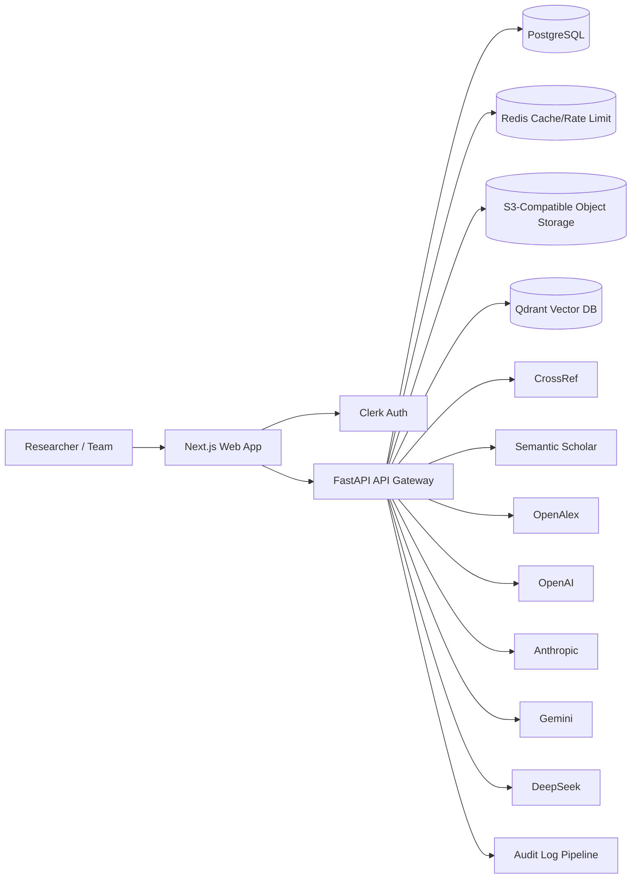
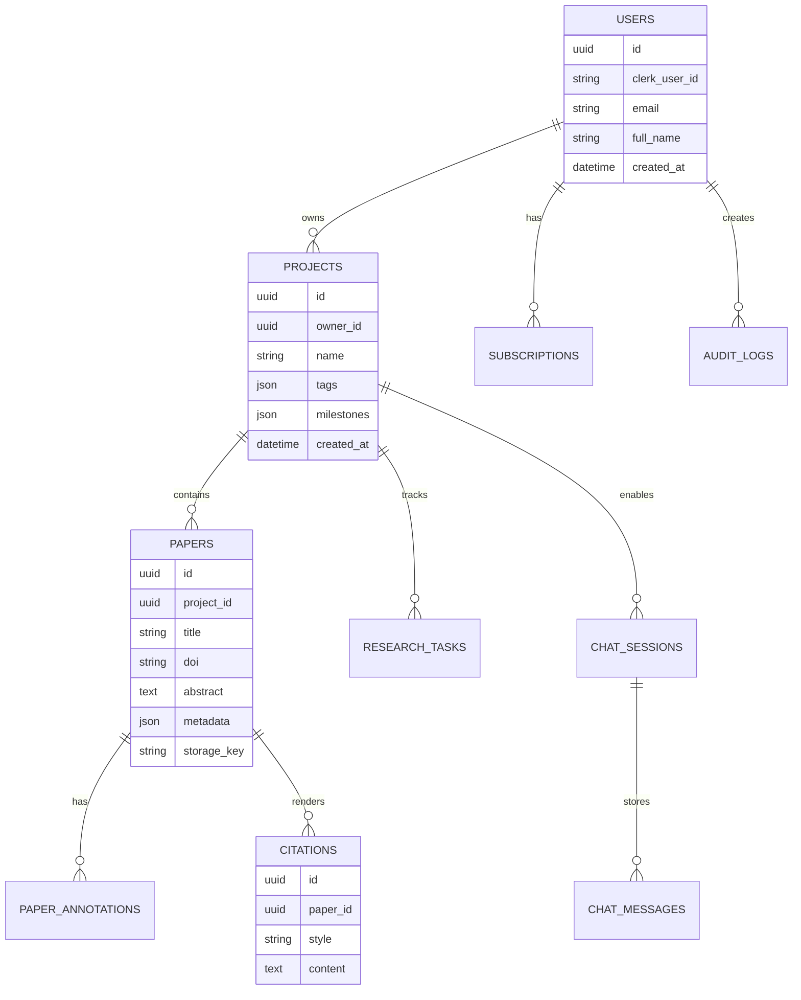

# System Architecture

## High-Level Architecture Diagram

## Component Responsibilities

- **Frontend (Next.js)**: project workspace, AI module UX, dashboard analytics, settings/billing views.
- **API (FastAPI)**: auth checks, project CRUD, PDF ingestion, RAG retrieval, AI orchestration.
- **PostgreSQL**: canonical transactional data.
- **Redis**: request throttling, hot response cache, session helpers.
- **Qdrant**: semantic retrieval over paper chunks.
- **S3-compatible storage**: raw PDF storage + generated artifacts.
- **AI Router**: provider selection/fallback for reliability and cost control.

## RAG Pipeline

1. Upload PDF.
2. Extract text with PyMuPDF; OCR fallback via Tesseract.
3. Chunk text into semantically coherent spans.
4. Generate embeddings (`text-embedding-3-small`).
5. Upsert vectors into Qdrant with paper/project metadata.
6. At query time, retrieve top-k chunks and ground generation.

## Multi-Tenant Security Model

- Every domain object resolves through authenticated user ownership.
- Team workspace support is added via organization scopes.
- Audit logs are stored for high-risk actions.
- Data is encrypted in transit (TLS) and at rest (managed cloud KMS).

## ER Diagram

